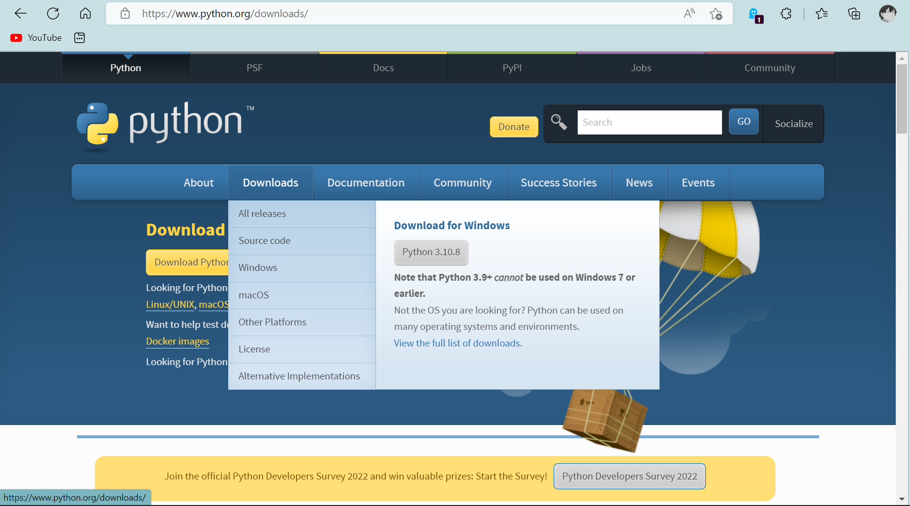
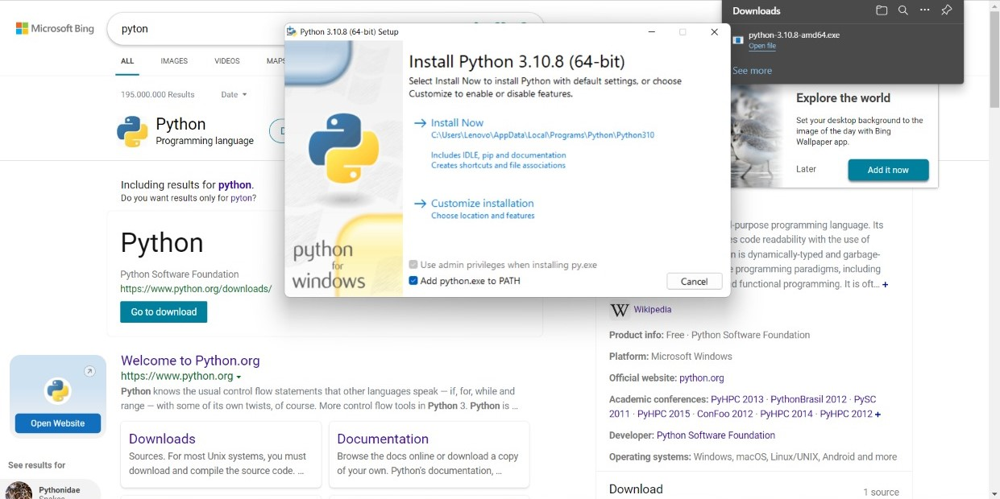
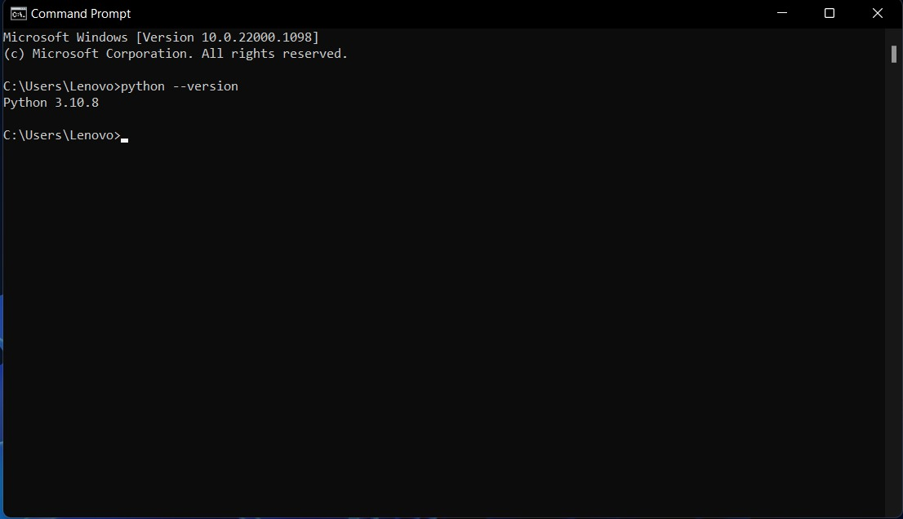
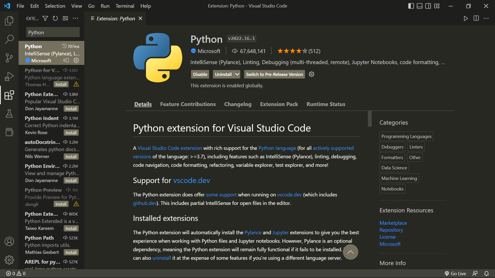
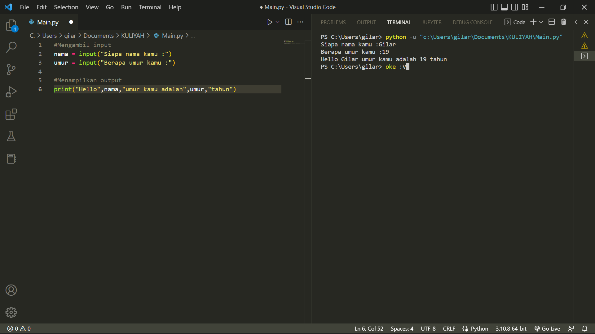

#Instalasi python di windows 11, menggunakan VScode

Note 
 - Bagi pengguna Linux, Python tidak perlu diinstal.
Karena Sebagian besar distro Linux sudah
menyediakannya secara default.

 - Bagi pengguna Windows, Download di situs resmi
python (python.org). Ikuti langkah instalasinya.

1. Buka website www.python.org
2. Klik menu download lalu pilih sesuai versi device kalian, di sini saya mendownload windows64bit.exe

3. Setelah download, install python. klik install now & jangan lupa centang add python.exe to PATH

4. Langkah berikut nya cek apakah python sudah terinstall/belum di device kita, cara ny buka CMD

5. Sebelum ny bagi yg belum menginstall VScode bisa insstall di https://code.visualstudio.com

6. Setelah menginstall VScode, langsung ke menu extension/ctrl+shift+X, search python yang sudah centang lalu klik install

7. Sesudah menginstall extension, python siap digunakan

